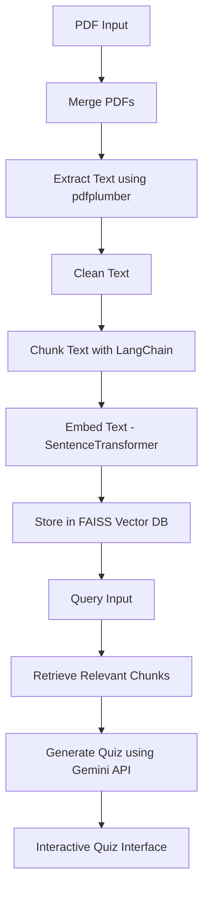

# 📘 Interactive Quiz Generator using RAG

This project generates multiple-choice quizzes from lecture PDFs using Retrieval-Augmented Generation (RAG) and large language models. While focused on educational content, the same RAG-based pipeline can be applied to domains like finance, healthcare, legal, and research enabling smart Q&A, summarization, and insight extraction from any PDF file.

---

## 🧩 Problem Statement

To automatically generate interactive multiple-choice quizzes from a collection of lecture PDFs using a pipeline that:

- Extracts and cleans text
- Embeds and indexes it for semantic retrieval
- Uses an LLM to generate quiz questions
- Presents the quiz interactively with scoring

---

## 🧠 Project Flowchart

---

## ⚙️ How It Works

### 1. 📥 PDF Input & Merging
- Merges multiple lecture PDFs using `PdfMerger`
- Produces a single merged file

### 2. 📄 Text Extraction
- Uses `pdfplumber` to extract content from all PDF pages

### 3. 🧹 Text Cleaning
- Removes unwanted lines, symbols, page numbers
- Normalizes whitespace and bullet formatting

### 4. 📚 Text Chunking
- Uses `RecursiveCharacterTextSplitter` to split into ~200 character chunks with 20-character overlap

### 5. 🔍 Embedding + Indexing
- Chunks are embedded using `SentenceTransformer (MiniLM)`
- Stored in a **FAISS** index for efficient semantic retrieval

### 6. 🎯 Retrieval-Augmented Generation (RAG)
- A query is embedded and top-k similar chunks are retrieved
- Chunks are passed to Gemini via API for quiz generation

### 7. 📝 Quiz Generation
- Gemini generates questions, options, and answers in a formatted block
- Regex is used to extract the data

### 8. 🧪 Interactive Quiz
- Asks user each MCQ interactively in the terminal
- Evaluates responses, gives feedback, and calculates final score

---

## 📦 Tech Stack

- **Python**
- `langchain`
- `sentence-transformers`
- `faiss`
- `pdfplumber`
- `google.generativeai`
- `regex`, `logging`, `numpy`, `sklearn`

---

## 🚀 Future Enhancements

- UI for PDF upload and quiz interface
- Score tracking and performance dashboards
- Personalized quiz suggestions based on past performance

---

## 📂 How to Use

1. Place PDFs in the working directory
2. Run the Jupyter notebook or Python script
3. Enter a topic/query for quiz generation
4. Take the quiz interactively in the terminal
